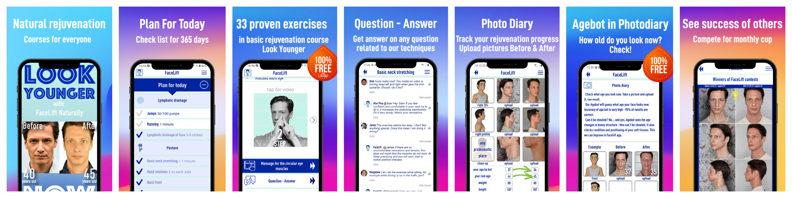
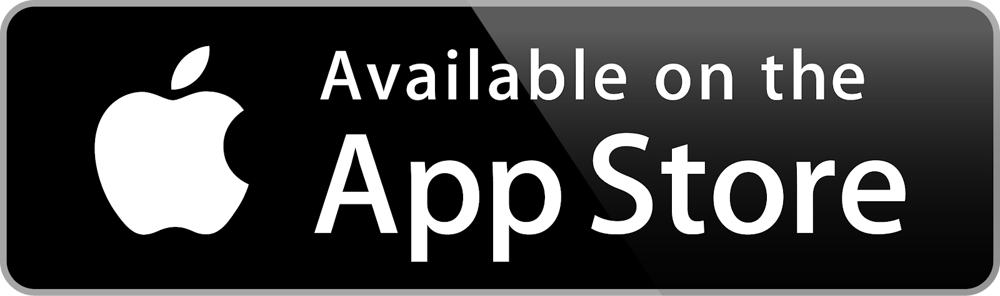
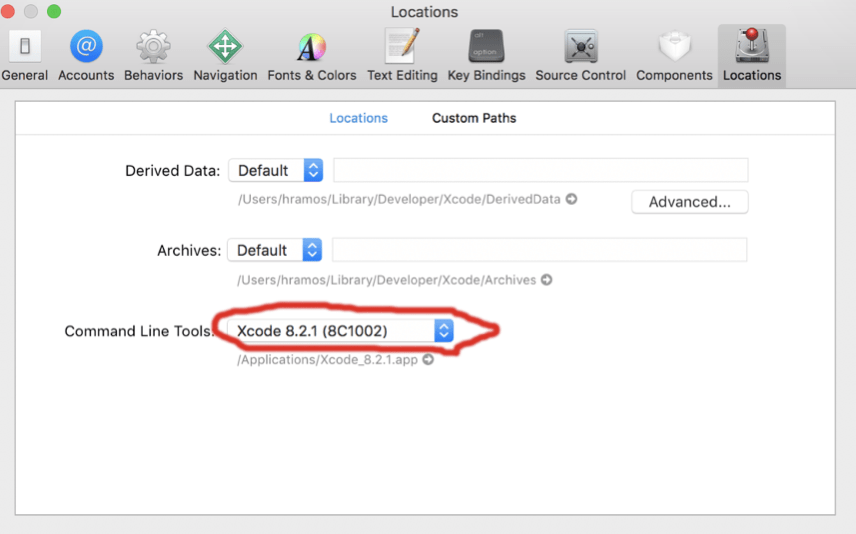

<div align="center">
	
</div>

<div align="center">
  <b><i>FaceLift Naturally is an app that showcases an anti-ageing workout method that helps to preserve attractiveness and reverse age-related changes in the face and posture. These natural rejuvenation activities have been proven to work and over the previous 5 years, this method has been trained by our specialists.</i></b>
</div>

---

<div align="center">
  
</div>
<br />

<div align="center">
	
</div>
<br />

<div align="center">
	<a href="#">
		
	</a>
	<a href="#">
		
	</a>
</div>
<br />

FaceLift Naturally is an app that showcases an anti-ageing workout method that helps to preserve attractiveness and reverse age-related changes in the face and posture. These natural rejuvenation activities have been proven to work and over the previous 5 years, this method has been trained by our specialists.


The technology of FaceLift Naturally allows you to seem younger without having to undergo plastic surgery or other cosmetic procedures. Our revolutionary technique of massages and exercises has helped over 30k practitioners in enhancing their faces and seem younger. Free download, freebies and prizes for your younger face!


Crow's feet, marionette lines, sagging eyelids, nasolabial folds, frown and horizontal forehead lines, smile wrinkles, edema, and double chin are just a few of the age-related problems that may be handled effectively with knowledge of natural rejuvenation techniques and devotion. The natural rejuvenation technique shown by FaceLift Naturally app is less risky than plastic surgery, with no scars, no procedures, and a lifting effect that you may achieve with time and effort.


With the help of the FaceLift Naturally app, you can practice the suggested face exercises at your convenient time and in your cozy place without wasting time in traffic and reception. It only takes 20 minutes a day for Basic course practitioners, which is less than any other time investment like in plastic surgery or injection treatments in a cosmetologist's office.


Botox injections may offer a soothing effect on frown lines. But from the standpoint of the FaceLift Naturally, facial injection is a bad choice and therefore, we emphasize relaxing the facial muscle with an approach to eliminate/prevent wrinkles while improving skin elasticity. By following our methods, you can get the perfect contour of your face without injecting plastic into your face.


The FaceLift Naturally app is extremely revitalizing when compared to face yoga. We delve much deeper into muscle anatomy, remove lingering face spasms, and concentrate on neck static and posture adjustment.


Try a DEMO course for free and without sign-up. Check these wonderful features:

●AGEBOT- Determine the age of your face.

●5 days of light training- You will give the study course in the main facelift programs.

●Question-Answer- Get a quick reply from the experts to your questions related to the exercises.


Try the Look Younger introductory course for three days for free with FaceLift Naturally app. If you stick with it, you'll get two weeks of easy natural rejuvenation technique learning, followed by monthly practise sessions every day and a comprehensive checklist of natural rejuvenation massages, manual techniques, and theoretical knowledge.


How To Use FaceLift Naturally:

-> Photo diary with AGEBOT- Track your rejuvenation progress.

-> Complete your profile with pictures from 5 angles before you start and keep records after. AI will assist you.

-> Plan for Today- Checklist with exercises to improve your face for every day.

-> Learn in 14 days amazing proven rejuvenation techniques with profound descriptions and videos.

-> Experience our coach support in the Question-Answer section.

-> Practice all year long with the Plan for Today checklist ready 365 days a year for you.

-> Contest- You can choose to share your images with others and take part in the contest of best results and WIN a money prize every month!


The Course Includes

1. 19 rejuvenating messages

2. 9 correctional exercises for posture and neck static.

3. 3 lymph drainage techniques improve lymph flow.

4. Vacuum massage techniques for the face.


5 more advanced courses are ready for you to enhance work out of problematic zones.

-> Neck zone and double chin

-> Forehead and eyes

-> Eyes and midface

-> Mouth, jaw and double chin

-> Posture and neck zone


Complete the basic Look Younger course and boost facial revitalization. Download the FaceLift Naturally app now!

## Contents

- [**Prerequisites**](#prerequisites)
- [**Getting Started**](#project-setup)
- [**Run App**](#run-app)

### **Prerequisites**

Make sure you have installed all of the following prerequisites on your development machine:

- **Homebrew** - Install [Homebrew](https://brew.sh/). For OSX and Linux machines.

  ```bash
  # Paste this in a macOS Terminal prompt.
  /usr/bin/ruby -e "$(curl -fsSL https://raw.githubusercontent.com/Homebrew/install/master/install)"
  ```

- **Node.js** - Download & Install [Node.js](https://nodejs.org/en/) and the npm package manager.

  If you have already installed Node on your system, make sure it is **Node 8.3 or newer**.

  ```bash
  # Paste this in a macOS Terminal prompt.
  brew install node
  ```

- **Yarn** - Download & Install [Yarn](https://yarnpkg.com/lang/en/docs/install)

  ```bash
  # Paste this in a macOS Terminal prompt.
  brew install yarn
  ```

- **Watchman** - Watchman is a tool by Facebook for watching changes in the filesystem.

  ```bash
  # Paste this in a macOS Terminal prompt.
  brew install watchman
  ```

- **Xcode & CocoaPods** - The easiest way to install Xcode is via the [Mac App Store](https://itunes.apple.com/us/app/xcode/id497799835?mt=12). (Required for iOS development)

  If you have already installed Xcode on your system, make sure it is version **9.4 or newer**.

  - Command Line Tools

    You will also need to install the Xcode Command Line Tools. Open Xcode, then choose "Preferences..." from the Xcode menu. Go to the Locations panel and install the tools by selecting the most recent version in the Command Line Tools dropdown.
    

  - CocoaPods
    ```bash
    # Paste this in a macOS Terminal prompt.
    sudo gem install cocoapods
    ```

- **Java Development Kit**
  ```bash
  # Paste this in a macOS Terminal prompt.
  brew tap AdoptOpenJDK/openjdk
  brew cask install adoptopenjdk8
  ```
- **Android development setup**

  1. [Download Android Studio](https://developer.android.com/studio/index.html) During the installation, add

     - Add Android SDK
     - Android SDK Platform
     - Performance (Intel ® HAXM)

  2. Configure the ANDROID_HOME environment variable

  ```bash
  # Add the following lines to your $HOME/.bash_profile or $HOME/.bashrc config file:

  export ANDROID_HOME=$HOME/Library/Android/sdk
  export PATH=$PATH:$ANDROID_HOME/emulator
  export PATH=$PATH:$ANDROID_HOME/tools
  export PATH=$PATH:$ANDROID_HOME/tools/bin
  export PATH=$PATH:$ANDROID_HOME/platform-tools
  ```

  ```bash
  # Type source $HOME/.bash_profile to load the config into your current shell. Verify that ANDROID_HOME has been added to your path by running echo $PATH.
  $HOME/.bash_profile
  echo $PATH
  ```

### **Project Setup**

1. **Clone** - Clone the project from git repository
2. **Dependencies Installation** - Go to project root and run yarn command. If on macOS machine go to ios folder and run pod install.
   ```bash
   # For dependencies installation paste this in a Terminal prompt.
   yarn
   # pod install
   cd ios && pod install
   ```

### **Run App**

- **android** - To run app in android open project in android studio (project-root/android), sync project after it press on run button. Android app can also run from command with following command:
  ```bash
    # For run android
    npx react-native run-android
  ```
- **iOS** - To run iOS app open project workspace file in xcode and run project by press on run button from xcode. iOS app can also run with following command:
  ```bash
    # For run iOS
    npx react-native run-ios
  ```
